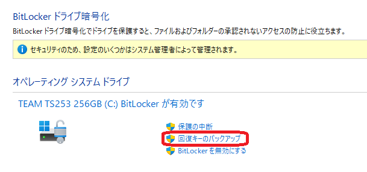
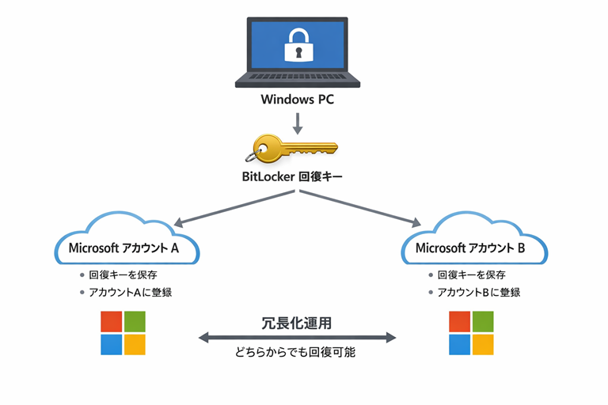

# [記事] BitLocker 複数 Microsoft アカウント運用の勧め

## BitLocker 回復キーの問題

Windows 11 pro / Enterprise の BitLocker 回復キーは、次の性質を持っています：

- PC 本体とは独立した「データ復旧の最後の砦」の役割
- 紛失すると復号できず、データは完全に失われる
- Microsoft アカウントにバックアップされるが、1つのアカウントに1個の制約
- ファイルやなど紙でも保管できるが、セキュリティと運用の面から現実的では無い
- 回復キーの実体はローカルPC内部にあるが、現在の仕様ではセキュリティー強化により参照出来ない

## 複数 Microsoft アカウント作成手順

ここで提案の BitLocker 回復キーを冗長化し、バックアップを作るための手順を示します。

- PC に Microsoft アカウント A でサインイン
- BitLocker を有効化（自動で A に回復キーが保存される）
- ローカルアカウントに切り替え
- Microsoft アカウント B でサインイン
- デバイス登録が行われる
- 手作業で「回復キーを Microsoft アカウントに保存」を実行
- B のアカウントにも回復キーが保存される

※重要：この手順は Windows のアカウント作成、サインインアカウント切り替えと、デバイス登録の仕組みを理解している個人向けです。
ここまでの説明が理解出来ない方にはお勧めしません。
Windows Home をご利用の場合は BitLocker が無いので利用出来ません。

---

**回復キーのバックアップ**

---

**Microsoftアカウントに保存する**

---

## なぜ複数の Microsoft アカウント利用が有効なのか

### 1. アカウントロックのリスクを回避できる

ここの質問でも時々ある、アカウント停止（誤検知含む）に結びつく、PIN 忘れ、パスワード忘れ、管理者になれない、多要素認証のトラブルの様な、1つの Microsoft アカウントに依存している「アカウントに入れない＝回復キーにアクセスできない」という最悪の状況を回避出来ます。

### 2. 管理者・自分の別アカウント・実験用など、複数の視点で管理できる

例えば1台のPCに、「常用」、「評価用」、「緊急用」などの目的別に複数アカウントを持つ人は、ユーザープロファイルの損傷によるトラブルの影響を受け難く、また複数の Microsoft アカウントに回復キーを保管しておくことで、どれか 1つが使えなくても復旧できるという冗長化によるシステムの保全が可能です。

**アカウント冗長化運用図**

### 3. Microsoft アカウントのデバイス管理は、アカウントごとに独立

この様な運用は、1台の同じPCであれば、アカウントが異なっても各ドライブの管理や BitLocker 回復キーが同じという事実に由来しています。

- アカウント A にログイン → PC のデバイス、回復キーが見える
- アカウント B にログイン → 同じ PCデバイス の回復キーが見える
という状態を作れるのがポイントです。

運用は少しだけ手間ですが、少しの工夫で、ファイルや紙などでによる回復キー保管よりもはるかに合理的、強力な運用が可能です。
ただし、Microsoft アカウントのデバイス管理機能自体は、結構な頻度でトラブルがあるので、注意ください

**なお Windows 11 Home や Copilot PC の BitLocker と似た暗号化技術、「デバイス暗号化」は、BitLocker とは異なる設計思想、運用方針のため、複数の Microsoft アカウントを作成しても回復キーを複製出来ません**。ご注意ください。

以上